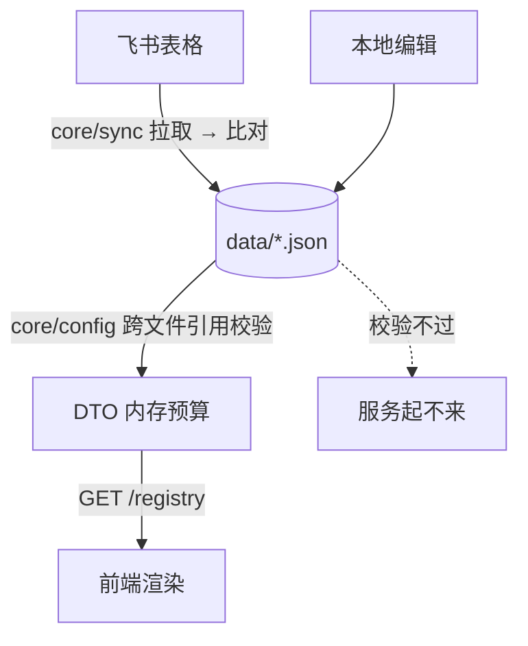
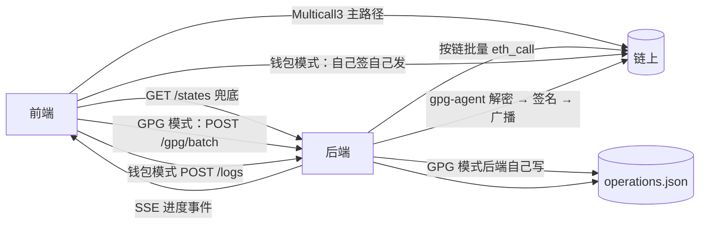
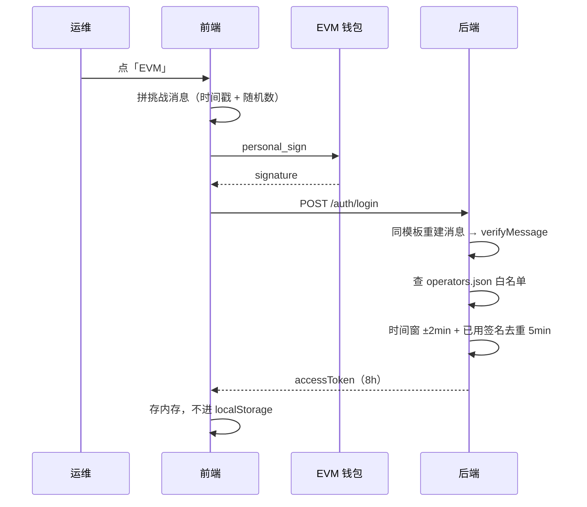
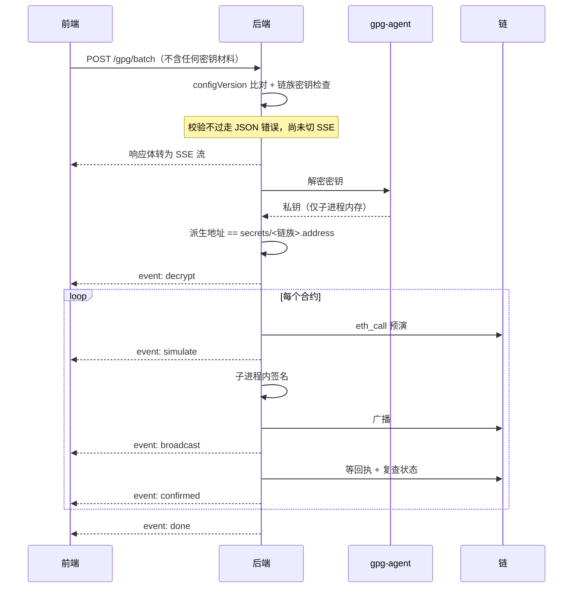
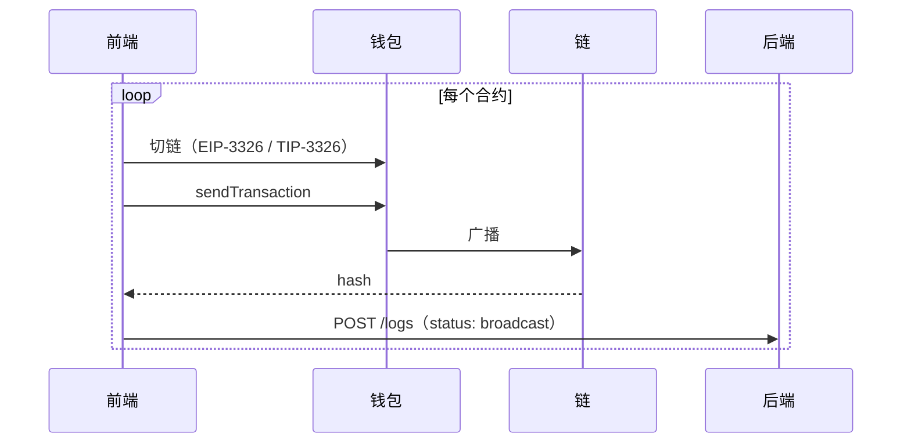

# 技术方案

多链合约运维控制台。勾选合约，批量暂停 / 恢复。EVM 多链 + Tron。

后端 Express + TypeScript（`src/` 58 文件），前端 Vue 3 + Element Plus（`src/` 23 文件）。
测试 283 + 72，覆盖率 80%。

操作方式见 [OPERATIONS.md](OPERATIONS.md)。

---

## 1. 项目目录

```
operator/
├── OPERATIONS.md        操作手册
├── ARCHITECTURE.md      本文
├── backend/
│   ├── data/            全部配置 JSON：chains · contracts · operators · rpc · sync
│   ├── secrets/         <链族>.key.gpg + <链族>.address，不入库
│   ├── scripts/         keys 密钥管理 · sync 拉数据 · check 启动前排查
│   └── src/
│       ├── routes/          1   path → controller
│       ├── controllers/     4   HTTP 出入口
│       ├── services/        4   编排，与 controller 一一对应
│       ├── core/            6   领域能力，不知道 HTTP
│       ├── repositories/    3   唯一碰磁盘的层
│       ├── models/          5   表结构：zod schema + 推导类型
│       ├── middlewares/     4   logging · auth · validate · error
│       ├── config/          2   env 常量 + 配置文件信封
│       └── lib/                 通用能力，对上层零依赖
│           ├── web3/        5   ChainAdapter · runner · chains · types
│           │   ├── evm/     5   client · tx · nonce · adapter · abi
│           │   └── tron/    3   client · tx · adapter
│           ├── keys/        3   gpg · signer · worker
│           ├── rpc/         2   endpoint · rpcProvider
│           ├── lark/        1   飞书表格读取
│           └── utils/       8   errors · logger · sse · mutex · net 等
└── frontend/src/
    ├── store/           唯一 Pinia store：index · api · session · catalog · execution
    ├── chain/           types · index 注册表 · abi，evm/ 与 tron/ 各 read + wallet
    ├── components/      5   WalletBar · AppSidebar · ContractList · GpgProgress · OperationLog
    ├── day.ts           本地日历日换算
    └── labels.ts        执行阶段中文名
```

`docs/` 下另有四份细节文档（架构手册 / 接口逐条 / 前端结构 / 接新链），不入库。

---

## 2. 架构分层

```
routes/          path → controller
controllers/     HTTP：ETag、SSE 帧、状态码、参数解析          4 个
services/        编排：把 core 能力按接口需要串起来            4 个
core/            领域能力：知道业务，不知道 HTTP               6 个
lib/             通用能力：不知道这是个合约管理平台
repositories/    唯一碰磁盘的层
models/          表结构：zod schema + 推导的类型
```

分层判据是「它知道什么」。

| 层 | 检验方式 |
|---|---|
| `lib/` | 能整体搬到别的项目 |
| `core/` | 能脱离 Express 单测 |
| `services/` | 与某个 controller 一一对应 |

三条依赖不变量：

```
core/ → services/ 或 controllers/            0 处
lib/  → core/ / services/ / controllers/     0 处
每个 controller → 恰好 1 个 service
```

`core/` 存在的理由是四个文件没有任何 service 装得下。

| 文件 | 消费者跨越 service 边界 |
|---|---|
| `config` | `server.ts` 启动即用，另有 3 个 service |
| `identity` | 主要消费者是中间件（每请求验 JWT） |
| `contractState` | `/states` 与执行前置检查共用 |
| `sync` | `registry.service` 与 `scripts/sync.ts` 都用 |

---

## 3. 功能模块

系统交付 8 项能力。分工原则：链上读由前端做、后端兜底；链上写看私钥在谁手里；
配置与审计后端是唯一真相源，前端只渲染。

| 功能 | 前端负责 | 后端负责 | 实现位置 |
|---|---|---|---|
| 身份与权限 | 连钱包、拼挑战消息、签名、token 存内存 | 验签、查白名单、发 JWT、角色拦截 | `core/identity` · `services/auth` · `middlewares/auth` |
| 配置管理 | 渲染业务线与合约、勾选、折叠 | 加载、跨文件校验、建索引、预算 DTO | `core/config` · `services/registry` |
| 数据同步 | 展示同步进度 | 拉飞书表格、与本地比对、有差异才写盘 | `core/sync` · `lib/lark` |
| 状态监控 | Multicall3 自读，主路径 | 兜底代读，按链批量 | `chain/*/read` · `core/contractState` |
| 批量执行·钱包 | 切链、逐笔签名、广播 | 只收一条日志 | `chain/*/wallet` |
| 批量执行·GPG | 发一个请求、渲染进度流 | 解密、预演、签名、广播、确认 | `core/execution` · `services/gpg` · `lib/keys` |
| 操作审计 | 按日期查看、按 hash 去重展示 | 唯一写入方，地址从 JWT 填 | `services/log` · `repositories/log` |
| 系统可观测 | 无 | 每请求回写 `x-request-id`，日志可串回链路 | `middlewares/logging` |

批量执行分成两个模块，因为它们的形状完全不同，不是同一功能的两种配置。
钱包模式私钥在运维自己手里，后端全程不碰；GPG 模式私钥在服务器上，前端不传任何密钥材料。

---

## 4. 数据流

配置从两个来源进 `data/`，经跨文件校验后预算成一份 DTO 常驻内存。
校验不过服务起不来，不会等到点下去才发现。



运行时分三条：读状态、发交易、记日志。读走前端优先，写走两条互斥的路。



链上状态默认由前端读，不占后端 RPC 配额，切业务线时刷新更快。
公开 RPC 常无 CORS 头会被浏览器拦截，此时退回 `GET /states`。

---

## 5. 时序图

### 登录



### GPG 批量执行



### 钱包模式执行



后端全程不碰私钥，只收日志。

---

## 6. 接口

9 个。响应统一 `{ success, data, error }`。除公开的两个外全部需要 JWT。

| 分组 | 接口 | 说明 |
|---|---|---|
| 公开 | `GET /health` | 存活探针。`npm run check` 与部署探针在用 |
| 公开 | `POST /auth/login` | 钱包签名登录，唯一发 token 的接口 |
| 配置 | `GET /registry/sync` | SSE。取数的唯一入口，`?force=1` 顺带重载本地配置 |
| 链上 | `GET /states` | 状态兜底。前端 multicall 被 CORS 拦时走这条 |
| 执行 | `POST /gpg/batch` | SSE。响应体即执行进度流 |
| 执行 | `POST /gpg/cancel` | 按操作者地址取消，不是按连接 |
| 审计 | `GET /logs` | 交易日志，倒序分页 + 时间窗 |
| 审计 | `GET /logs/daily` | 每日笔数，日期选择器角标 |
| 审计 | `POST /logs` | 钱包模式广播后上报 |

取数只有 `/registry/sync` 一个入口。它是一条状态流，结束时给出全量配置 ——
过程中的每一步（拉取 / 比对 / 应用）都是事件，所以不需要另一个接口去问「现在什么情况」。
`?force=1` 同时承担重载：手改 `data/*.json` 后点「重新同步」即可生效。

原来还有 `GET /registry`（纯内存降级）与 `POST /registry/reload`（admin 热重载），
都已并入。前者只在 SSE 断流时用，而这是个跑在 localhost 的工具，中间没有会掐长连接的代理；
后者零调用方，它的职责被 `?force=1` 覆盖了。

`states` 读的是链上而非配置，合并会让配置接口变慢且不可缓存，所以留着。

---

## 7. 身份验证

| 阶段 | 环节 | 机制 |
|---|---|---|
| 挑战 | 消息构造 | 前端自拼，含时间戳与随机数；后端逐字重建后验签 |
| 挑战 | 服务端 nonce | 不需要。省一次往返，服务端不存状态 |
| 挑战 | 防重放 | 时间窗 ±2 分钟 + 已用签名内存去重 5 分钟 |
| 授权 | 白名单 | `data/operators.json`，地址不在其中返回 403 |
| 令牌 | 算法 | JWT HS256 自实现，不引第三方库以减攻击面 |
| 令牌 | 有效期 | 8 小时 |
| 令牌 | 签名密钥 | 生产每次启动随机生成；开发缓存 `secrets/.jwt-dev` |
| 令牌 | 前端存储 | 只存内存。刷新页面重新登录 |
| 令牌 | 传输 | `Authorization` 头；SSE 因 EventSource 限制走 query，仅对 GET 生效 |

登录只认 EVM 签名。Tron 钱包仅用于钱包模式发交易，不参与登录，顶栏下拉标注此点。

授权分三层，各管一件事，不重复。

| 层 | 内容 | 拦截位置 |
|---|---|---|
| 能否登录 | 白名单 + 验签 | `auth.service` |
| 能否写 | 角色不是 viewer | `requireWriteRole` 中间件 |
| 有无密钥 | 所选合约的每个链族都配了密钥 | `assertAuthorized` |

不做部分放行。半停半没停的中间态比全不执行更危险。

---

## 8. 前端数据获取与处理

```
store/     唯一 Pinia store，三块组合
           session    身份与签名方式
           catalog    配置目录、链上状态、勾选、折叠
           execution  批量执行与进度事件
chain/     evm/ 与 tron/ 各一套 read + wallet，index.ts 按链族分派
```

三块之间不互相 import，跨块调用只在 `store/index.ts`。组件不直接调 api。

| 数据 | 获取方式 | 降级 |
|---|---|---|
| 配置 | `GET /registry/sync`（SSE，带同步进度） | 无。失败即抛出，用户点「重新同步」重试 |
| 链上状态 | 前端 Multicall3 按链批量 | `GET /states` 后端代读 |
| 交易日志 | `GET /logs` + `/logs/daily` | 失败不阻断加载 |

处理上的三条约定：

- 交易日志按 `hash` 去重保留最新状态。GPG 模式后端写两条，钱包模式只有一条，不去重则钱包模式的交易永不显示
- 日期按本地日历日切分。`ts` 存 UTC，按 UTC 切日会把晚间操作算进次日
- 执行阶段中文名集中在 `labels.ts`，列表与弹窗共用一份

钱包发现走广播式标准，EVM 用 EIP-6963，Tron 用 TIP-6963。选定 provider 后不回落全局对象，
否则装了多个钱包时会出现「点了 A 却用 B 签名」。两个事件名大小写不同，`eip6963:` 小写、`TIP6963:` 大写。

---

## 9. 安全设计

| 类别 | 面 | 措施 |
|---|---|---|
| 密钥 | 口令传输 | 从不经过 HTTP。解密由服务器本机 gpg-agent + pinentry 负责 |
| 密钥 | 私钥生命周期 | 仅存在于一次性子进程内存，用完 `exit`。gpg 独立进程组，超时杀整组 |
| 密钥 | 掉包检测 | 派生地址必须等于 `secrets/<链族>.address`，不等立即中止 |
| 密钥 | 已签名数据 | rawTx 只在广播函数局部变量存在，不进日志、不进 API、不进前端 |
| 身份 | 令牌 | 只存前端内存；后端签名密钥每次启动随机生成，无长期密钥可泄露 |
| 身份 | 操作可追溯 | 日志地址一律从 JWT 填，忽略请求体身份字段 |
| 凭证 | RPC | 含 apiKey 的 URL 永久 `public:false`，不下发前端 |
| 凭证 | 访问日志 | 请求头一个都不落盘，`Authorization` 无机会进入日志对象 |
| 输入 | 校验 | zod 在系统边界校验；GPG 批量额外要求手输 CONFIRM |
| 输入 | 操作范围 | 操作是编译期可穷举的闭集，调用方无法传入任意合约方法名 |

链上状态的读取采取「宁可读不到，不可读错」。`paused()` 返回值必须是 32 字节的 0 或 1，
否则视为读不到。解码器会把任何非零值当 true，而把地址配错显示成「已暂停」会让运维直接跳过该合约。

---

## 10. 非功能要求

| 类别 | 维度 | 现状 |
|---|---|---|
| 可靠 | 可用性 | 优先于数据新鲜度。飞书挂了不挡控制台，解析出 0 个合约不覆盖本地 |
| 可靠 | 上链保障 | 等回执 → 查状态 → 同 nonce 提价重发最多 4 次 → 自转账让出 nonce |
| 可靠 | 容错 | 单链读失败不影响其它链；单笔失败不中断整批；签名失败中止但已广播的等到终态再汇报 |
| 可靠 | 一致性 | `expectedConfigVersion` 比对，配置漂移直接拒绝执行 |
| 性能 | 响应 | DTO 加载时预算，请求路径零计算 |
| 性能 | 并发 | 同一「链 + 签名地址」的批次串行；跨链并行 |
| 运维 | 可观测 | 每请求 `x-request-id` 回写响应头，链路日志可串回 |
| 运维 | 可扩展 | 加 EVM 链零代码；加链族实现一个 adapter + 注册一行 |
| 运维 | 部署 | v1 单实例。任务与签名去重表在内存，不支持水平扩展 |

---

## 11. 已知边界

SSE 每 15 秒发心跳注释防代理断连，没有断线重放。连接断开即任务结束，状态由落盘日志兜底。
`POST /gpg/cancel` 按操作者地址取消，覆盖页面刷新、换设备、代理缓冲三种连接已失效的场景。

「平台做 pause / unpause」这条领域事实横跨三处，加操作时需同步。

| 位置 | 内容 | 同步保障 |
|---|---|---|
| `core/operations.ts` | 操作语义 | `executor.test.ts` 守着与 ABI 一致 |
| `lib/web3/evm/abi.ts` | EVM 编码 | 同上 |
| `frontend/chain/abi.ts` | 钱包模式编码 | 跨包，靠 `canEncode()` 运行时挡下 |

分开的理由是 `core` 链无关，而 Solidity ABI 只对 EVM 成立。Tron 用方法签名字符串，Solana 用 IDL。
