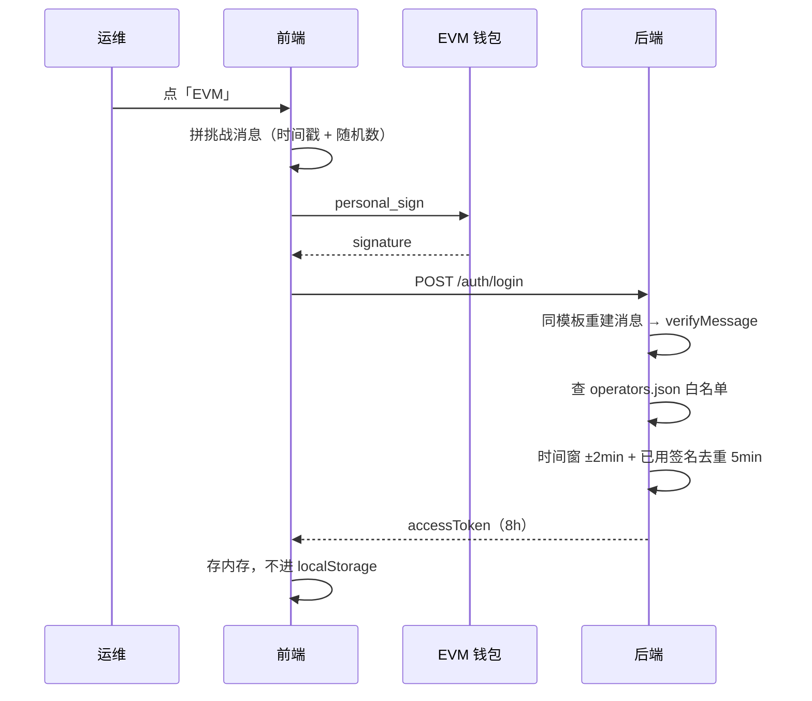
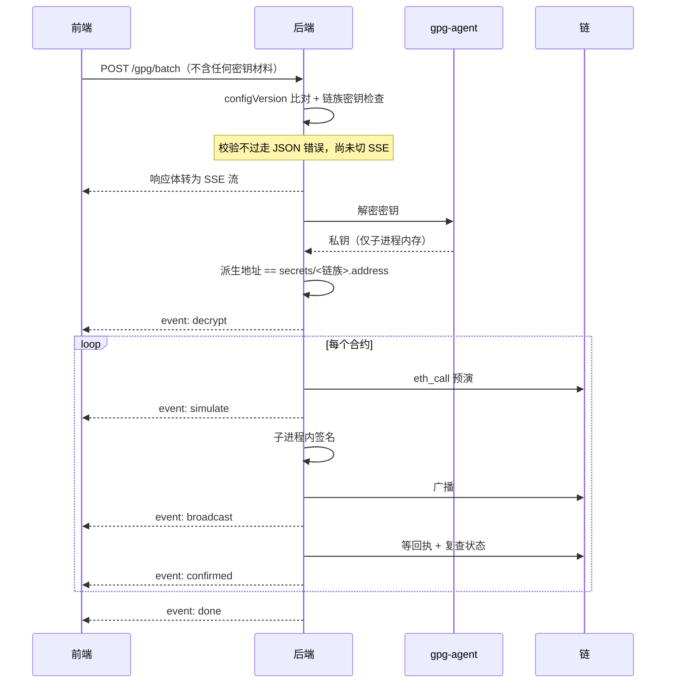
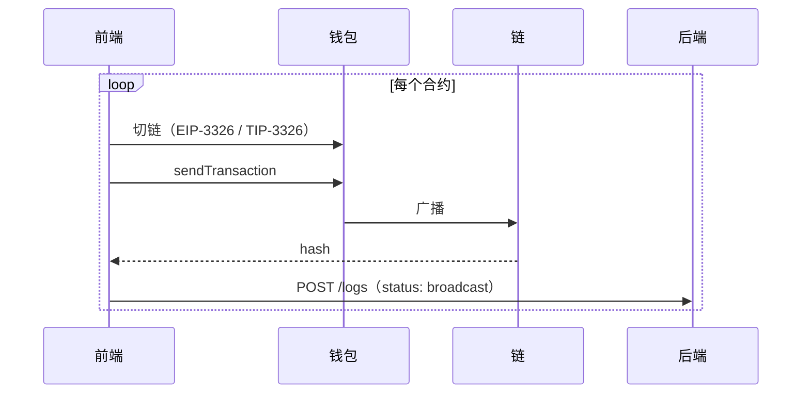

# 技术方案

多链合约运维控制台。勾选合约，批量暂停 / 恢复。EVM 多链 + Tron。

后端 Express + TypeScript（`src/` 58 文件），前端 Vue 3 + Element Plus（`src/` 23 文件）。
测试 283 + 72，覆盖率 80%。

操作方式见 [OPERATIONS.md](OPERATIONS.md)。

---

## 1. 架构分层

```
routes/          path → controller
controllers/     HTTP：ETag、SSE 帧、状态码、参数解析          4 个
services/        编排：把 core 能力按接口需要串起来            4 个
core/            领域能力：知道业务，不知道 HTTP               6 个
lib/             通用能力：不知道这是个合约管理平台
repositories/    唯一碰磁盘的层
models/          表结构：zod schema + 推导的类型
```

分层判据是「它知道什么」。

| 层 | 检验方式 |
|---|---|
| `lib/` | 能整体搬到别的项目 |
| `core/` | 能脱离 Express 单测 |
| `services/` | 与某个 controller 一一对应 |

三条依赖不变量：

```
core/ → services/ 或 controllers/            0 处
lib/  → core/ / services/ / controllers/     0 处
每个 controller → 恰好 1 个 service
```

`core/` 存在的理由是四个文件没有任何 service 装得下。

| 文件 | 消费者跨越 service 边界 |
|---|---|
| `config` | `server.ts` 启动即用，另有 3 个 service |
| `identity` | 主要消费者是中间件（每请求验 JWT） |
| `contractState` | `/states` 与执行前置检查共用 |
| `sync` | `registry.service` 与 `scripts/sync.ts` 都用 |

---

## 2. 功能模块

| 模块 | 位置 | 职责 |
|---|---|---|
| 配置注册表 | `core/config` | 加载 + 跨文件引用校验 + 建索引 + 预算 DTO |
| 执行编排 | `core/execution` | 授权 → 前置检查 → 按链并行 → 事件汇总 |
| 数据同步 | `core/sync` | 飞书表格拉取 → 比对 → 有差异才写盘 |
| 状态读取 | `core/contractState` | 按链批量读 `paused()` |
| 身份令牌 | `core/identity` | JWT 签发与校验 |
| 操作定义 | `core/operations` | 操作闭集 + 前置条件 + 预期结果 |
| 链适配 | `lib/web3` | EVM / Tron 两套 adapter + 公共批量循环 |
| 密钥 | `lib/keys` | GPG 解密 + 签名子进程 |
| RPC | `lib/rpc` | 三级降级：Lark → Alchemy → ChainList |

---

## 3. 数据流

```
配置来源                     运行时
────────                    ────────
飞书表格 ─┐                  前端 ─── Multicall3 ──→ 链上（读状态，主路径）
          ├→ data/*.json      │
本地编辑 ─┘      │             └─── GET /states ──→ 后端 ─→ 链上（兜底）
                 ↓
          core/config 校验 ──→ DTO（内存预算）──→ GET /registry ──→ 前端渲染
                                                        ↓
                                              交易日志 data/operations.json
```

配置改动必须经 `core/config` 的跨文件校验，引用不存在的链或业务线时服务起不来。

链上状态默认由前端读，理由是不占后端 RPC 配额、切业务线时刷新更快。
公开 RPC 常无 CORS 头会被浏览器拦截，此时退回 `GET /states`。

---

## 4. 时序图

### 登录



### GPG 批量执行



### 钱包模式执行



后端全程不碰私钥，只收日志。

---

## 5. 接口

13 个。响应统一 `{ success, data, error }`。除前两个外全部需要 JWT。

| 方法 | 路径 | 说明 |
|---|---|---|
| GET | `/health` | 存活探针，无需认证 |
| POST | `/auth/login` | 钱包签名登录，唯一发 token 的接口 |
| GET | `/registry` | 配置全量，带 ETag，纯内存 |
| GET | `/registry/sync` | SSE。先与飞书表格比对再给数据 |
| GET | `/states` | 链上状态兜底 |
| POST | `/registry/reload` | 热重载，仅 admin |
| POST | `/gpg/batch` | SSE。响应体即执行进度流 |
| POST | `/gpg/cancel` | 按操作者地址取消 |
| GET | `/logs` | 交易日志，倒序分页 + 时间窗 |
| GET | `/logs/daily` | 每日笔数，日期选择器角标 |
| POST | `/logs` | 钱包模式广播后上报 |
| GET | `/state` | 系统快照，纯内存 |
| GET | `/state/rpc` | 各链 RPC 探测，慢一个量级 |

`/state` 与 `/state/rpc` 拆开的理由是快慢差一个量级，合并会让顶栏健康指示被节点探测拖住。

---

## 6. 身份验证

| 环节 | 机制 |
|---|---|
| 挑战消息 | 前端自拼（含时间戳 + 随机数），后端逐字重建后验签 |
| 服务端 nonce | 不需要。省一次往返，服务端不存状态 |
| 防重放 | 时间窗 ±2 分钟 + 已用签名内存去重 5 分钟 |
| 白名单 | `data/operators.json`，地址不在其中返回 403 |
| 令牌 | JWT HS256 自实现，8 小时，不引第三方库以减攻击面 |
| 签名密钥 | 生产每次启动随机生成；开发缓存 `secrets/.jwt-dev` |
| 前端存储 | 只存内存。刷新页面重新登录 |
| 传输 | `Authorization` 头；SSE 因 EventSource 限制走 query，且仅对 GET 生效 |

登录只认 EVM 签名。Tron 钱包仅用于钱包模式发交易，不参与登录，顶栏下拉标注此点。

授权分三层，各管一件事，不重复。

| 层 | 内容 | 拦截位置 |
|---|---|---|
| 能否登录 | 白名单 + 验签 | `auth.service` |
| 能否写 | 角色不是 viewer | `requireWriteRole` 中间件 |
| 有无密钥 | 所选合约的每个链族都配了密钥 | `assertAuthorized` |

不做部分放行。半停半没停的中间态比全不执行更危险。

---

## 7. 前端数据获取与处理

```
store/     唯一 Pinia store，三块组合
           session    身份与签名方式
           catalog    配置目录、链上状态、勾选、折叠
           execution  批量执行与进度事件
chain/     evm/ 与 tron/ 各一套 read + wallet，index.ts 按链族分派
```

三块之间不互相 import，跨块调用只在 `store/index.ts`。组件不直接调 api。

| 数据 | 获取方式 | 降级 |
|---|---|---|
| 配置 | `GET /registry/sync`（SSE，带同步进度） | `GET /registry` 纯本地 |
| 链上状态 | 前端 Multicall3 按链批量 | `GET /states` 后端代读 |
| 交易日志 | `GET /logs` + `/logs/daily` | 失败不阻断加载 |

处理上的三条约定：

- 交易日志按 `hash` 去重保留最新状态。GPG 模式后端写两条，钱包模式只有一条，不去重则钱包模式的交易永不显示
- 日期按本地日历日切分。`ts` 存 UTC，按 UTC 切日会把晚间操作算进次日
- 执行阶段中文名集中在 `labels.ts`，列表与弹窗共用一份

钱包发现走广播式标准，EVM 用 EIP-6963，Tron 用 TIP-6963。选定 provider 后不回落全局对象，
否则装了多个钱包时会出现「点了 A 却用 B 签名」。两个事件名大小写不同，`eip6963:` 小写、`TIP6963:` 大写。

---

## 8. 安全设计

| 面 | 措施 |
|---|---|
| 口令传输 | 从不经过 HTTP。GPG 解密由服务器本机 gpg-agent + pinentry 负责 |
| 私钥生命周期 | 仅存在于一次性子进程内存，用完 `exit`。gpg 独立进程组，超时杀整组 |
| 密钥掉包 | 派生地址必须等于 `secrets/<链族>.address`，不等立即中止 |
| 已签名数据 | rawTx 只在广播函数局部变量存在，不进日志、不进 API、不进前端 |
| 令牌 | 只存前端内存；后端签名密钥每次启动随机生成，无长期密钥可泄露 |
| RPC 凭证 | 含 apiKey 的 URL 永久 `public:false`，不下发前端，`/state/rpc` 剔除 `rawUrl` |
| 访问日志 | 请求头一个都不落盘，`Authorization` 无机会进入日志对象 |
| 输入校验 | zod 在系统边界校验；GPG 批量额外要求手输 CONFIRM |
| 操作可追溯 | 日志地址一律从 JWT 填，忽略请求体身份字段 |
| 危险操作范围 | 操作是编译期可穷举的闭集，调用方无法传入任意合约方法名 |

链上状态的读取采取「宁可读不到，不可读错」。`paused()` 返回值必须是 32 字节的 0 或 1，
否则视为读不到。解码器会把任何非零值当 true，而把地址配错显示成「已暂停」会让运维直接跳过该合约。

---

## 9. 非功能要求

| 维度 | 现状 |
|---|---|
| 可用性 | 优先于数据新鲜度。飞书挂了不挡控制台，解析出 0 个合约不覆盖本地 |
| 上链保障 | 等回执 → 查状态 → 同 nonce 提价重发（最多 4 次）→ 自转账让出 nonce |
| 容错 | 单链读失败不影响其它链；单笔失败不中断整批；签名失败中止但已广播的等到终态再汇报 |
| 一致性 | `expectedConfigVersion` 比对，配置漂移直接拒绝执行 |
| 性能 | DTO 加载时预算，请求路径零计算；`/registry` 带 ETag |
| 并发 | 同一 `(链, 签名地址)` 的批次串行；跨链并行 |
| 可观测 | 每请求 `x-request-id` 回写响应头，链路日志可串回 |
| 可扩展 | 加 EVM 链零代码；加链族实现一个 adapter + 注册一行 |
| 部署 | v1 单实例。任务与签名去重表在内存，不支持水平扩展 |

---

## 10. 已知边界

SSE 每 15 秒发心跳注释防代理断连，没有断线重放。连接断开即任务结束，状态由落盘日志兜底。
`POST /gpg/cancel` 按操作者地址取消，覆盖页面刷新、换设备、代理缓冲三种连接已失效的场景。

「平台做 pause / unpause」这条领域事实横跨三处，加操作时需同步。

| 位置 | 内容 | 同步保障 |
|---|---|---|
| `core/operations.ts` | 操作语义 | `executor.test.ts` 守着与 ABI 一致 |
| `lib/web3/evm/abi.ts` | EVM 编码 | 同上 |
| `frontend/chain/abi.ts` | 钱包模式编码 | 跨包，靠 `canEncode()` 运行时挡下 |

分开的理由是 `core` 链无关，而 Solidity ABI 只对 EVM 成立。Tron 用方法签名字符串，Solana 用 IDL。
